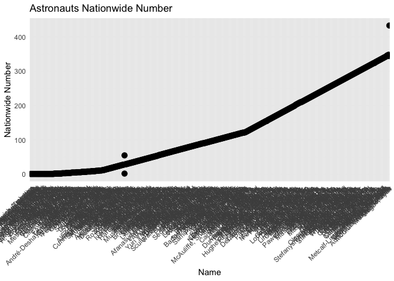

week-5
================
Sneha
2024-11-12

<u>**A list of at least 3 columns (or values) in your data which are
unclear *untit* you read the documentation.**</u>

1.  field21 - In the astronaut dataset field21 refer to “Instances of
    EVA by mission”. Which would have remained unclear until referring
    the documentation. The context doesn’t explicitly mention the nature
    of **Field21,** it might have an indirect or direct relationship to
    **Instances of EVA (Extravehicular Activity) by mission.**

**Why do you think they chose to encode the data the way they did?**

According to my analysis, there might be some relationship with EVA in
someway. some points i can think of are :

**Mission duration**: Longer missions might have more EVAs as astronauts
have more time and requirements to perform spacewalks.

**Mission type**: Different mission types (e.g., space station
maintenance, exploration) could determine how often EVAs occur.

**Crew size**: Larger crews might allow for more EVA activities due to
more available astronauts.

**What could have happened if you didn’t read the documentation?**

If I hadn’t referred to the documentation, it would have been nearly
impossible to understand what ‘field21’ represents. There is no
explanation available on the internet either, which strongly suggests
that the dataset’s author may have named the column based on their own
intuition or internal conventions.

- **2.military_civilian** – In the astronaut dataset, this column
  represents the military status of the astronauts.

**Why do you think they chose to encode the data this way?**

Astronauts may be recruited from the navy or military for specific
missions, or they could be scientists selected for space exploration
based on their research expertise. Additionally, civilians such as
tourists, journalists, or other non-military personnel may also travel
to space. This diversity in backgrounds likely explains why the author
labeled the column “military_civilian” to distinguish between military
personnel and civilians.

**What could have happened if you didn’t read the documentation?**

Without reading the documentation, understanding the exact meaning of
this column would have been confusing. However, by analyzing the dataset
in more detail, we might have inferred that it refers to a distinction
between military and civilian astronauts based on context clues in other
columns.

- 3)**eva_hrs_mission** – In the astronaut dataset, this refers to the
  “duration of extravehicular activities (EVA) during the mission.”

**Why do you think they chose to encode the data this way?**

The likely reason for this encoding is that the dataset author simply
abbreviated “extravehicular activities during the mission” without much
consideration for clarity. However, this could easily cause confusion
for users, as many might assume it represents the count or number of EVA
instances rather than the duration.

**What could have happened if you didn’t read the documentation?**

Without consulting the documentation, this column could easily be
misinterpreted. Since “field21” already captures the number of EVA
instances per mission, and this column measures EVA duration, the two
could be confused, leading to ambiguity in understanding the dataset.

<u>**At least one element or your data that is unclear even *after*
reading the documentation**</u>

1)  The column I found to be unclear is **“nationwide_number.”** The
    documentation describes it as “Number within country,” but this
    explanation is vague and doesn’t provide a clear understanding of
    what it represents. I explored the additional articles and databases
    referenced in the documentation, but none provided any further
    information on **nationwide_number.**

    The documentation fails to clarify the data’s significance or
    context. Based on my analysis of the dataset, it appears that this
    column represents a unique identifier assigned to each astronaut
    within their respective country, likely based on their rank or order
    of selection. This assumption can be supported by the fact that no
    two astronauts share the same number within their nation. We will be
    visualizing this later below.

<!-- -->

2)  Another unclear element in the dataset is the abbreviation **“MSP”**
    in the column **“occupation.”**

    The dataset documentation does not provide any explanation of what
    **MSP** stands for, and the references linked in the documentation
    also offer no clarification. Given that it falls under the
    astronaut’s occupation, I believe **MSP** likely stands for
    **“Mission Specialist Pilot,”** based on my research into space
    travel terminology. It seems the author may have abbreviated the
    term for simplicity, but unfortunately, they did not include
    sufficient details in the dataset to make this clear.

LOADING DATASET:

``` r
library(tidyverse)
```

    ## ── Attaching core tidyverse packages ──────────────────────── tidyverse 2.0.0 ──
    ## ✔ dplyr     1.1.4     ✔ readr     2.1.5
    ## ✔ forcats   1.0.0     ✔ stringr   1.5.1
    ## ✔ ggplot2   3.5.1     ✔ tibble    3.2.1
    ## ✔ lubridate 1.9.3     ✔ tidyr     1.3.1
    ## ✔ purrr     1.0.2     
    ## ── Conflicts ────────────────────────────────────────── tidyverse_conflicts() ──
    ## ✖ dplyr::filter() masks stats::filter()
    ## ✖ dplyr::lag()    masks stats::lag()
    ## ℹ Use the conflicted package (<http://conflicted.r-lib.org/>) to force all conflicts to become errors

``` r
astro <- read_delim('/Users/sneha/H510-Statistics/astronaut-data.csv')
```

    ## Rows: 1277 Columns: 23
    ## ── Column specification ────────────────────────────────────────────────────────
    ## Delimiter: ","
    ## chr (10): name, sex, nationality, military_civilian, selection, occupation, ...
    ## dbl (13): id, number, nationwide_number, year_of_birth, year_of_selection, m...
    ## 
    ## ℹ Use `spec()` to retrieve the full column specification for this data.
    ## ℹ Specify the column types or set `show_col_types = FALSE` to quiet this message.

<u>**VISUALIZATION:**</u>

Getting the count of particular occupation :

``` r
occupation_counts <- astro |>
  count(occupation) |>
  arrange(desc(n))
occupation_counts
```

    ## # A tibble: 9 × 2
    ##   occupation                  n
    ##   <chr>                   <int>
    ## 1 MSP                       498
    ## 2 commander                 315
    ## 3 flight engineer           196
    ## 4 pilot                     196
    ## 5 PSP                        59
    ## 6 Space tourist              10
    ## 7 Other (Journalist)          1
    ## 8 Pilot                       1
    ## 9 spaceflight participant     1

``` r
ggplot(occupation_counts, aes(x = occupation, y = n)) +
  geom_bar(stat = "identity", fill = "skyblue") +
  theme_minimal() +
  labs(title = "Occupation Counts of Astronauts",
       x = "Occupation",
       y = "Count") +
  theme(axis.text.x = element_text(angle = 45, hjust = 1))
```

<!-- -->

The occupation **MSP** has the highest count in the dataset, prompting
us to question what this occupation actually represents, as many
astronauts fall under this category. After further analysis and
research, I conclude that **MSP** likely stands for **Mission
Specialist.** According to various sources, Mission Specialists are
astronauts assigned specific duties related to their mission. There are
several sub-categories of Mission Specialists, such as **Educator
Mission Specialist, International Mission Specialist,** and **USAF
Manned Spaceflight Engineer.** Unfortunately, all of these distinct
roles seem to have been grouped under the umbrella term **MSP,** which
limits the accuracy and granularity needed for proper data analysis.

lets analyse if **nationwide_number** is a unique number given to
astronauts in nation.

**MY ASSUMPTION** : nationwide_number : Unique identifier assigned to
each astronaut within their respective country, likely based on their
rank or order of selection

Order the dataset by the name column, below tibble has unique astronauts
grouped by nation and nationwide_number

``` r
uniqueness_check <- astro |>
  distinct(nationality, nationwide_number,name) |>
  arrange(name)
uniqueness_check
```

    ## # A tibble: 566 × 3
    ##    nationality    nationwide_number name                            
    ##    <chr>                      <dbl> <chr>                           
    ##  1 U.S.                         314 Acaba, Joseph M.                
    ##  2 U.S.                         104 Acton, Loren Wilbur             
    ##  3 U.S.                         131 Adamson, James C.               
    ##  4 U.S.S.R/Russia                70 Afanasyev, Viktor Mikhaylovich  
    ##  5 Kazakhstan                     1 Aidyn (Aydyn) Akanovich Aimbetov
    ##  6 U.S.                         144 Akers, Thomas D.                
    ##  7 Japan                          1 Akiyama, Toyohiro               
    ##  8 U.S.S.R/Russia                36 Aksyonov, Vladimir              
    ##  9 UAE                            1 Al Mansoori, Hazzaa             
    ## 10 Saudi Arabia                   1 Al-saud, Sultan bin Salman      
    ## # ℹ 556 more rows

Now, lets visualize this with a graph : if its a unique number, then the
graph would show a line in increasing order where a single astronaut
would not have 2 values.

``` r
ggplot(uniqueness_check, aes(x = reorder(name, nationwide_number), y = nationwide_number)) +
  geom_point(stat = "identity", fill = "skyblue", size = 3) +  
  theme_minimal() +
  labs(title = "Astronauts Nationwide Number",
       x = "Name",
       y = "Nationwide Number") +
  theme(axis.text.x = element_text(angle = 45, hjust = 1)) 
```

<!-- -->

**IGNORE THE MESSY NAME IN X-AXIS**(there are a lot of unique values
which cannot be plotted here, but this graph helps us focus on
visualization to get the clear picture) I have plotted a better graph
below.

Here we could see that there are multiple values plotted for two
astronauts. On deeper analysis(analyzing values in the tibble :
uniqueness_check) it can be seen as below :

|     |
|-----|
|     |

Lets visualize this:

``` r
Unique_below_100 <- uniqueness_check |>
  distinct(nationality, nationwide_number,name) |>
  filter(nationwide_number >= 0, nationwide_number <= 60 ) 
  
Unique_below_100
```

    ## # A tibble: 213 × 3
    ##    nationality    nationwide_number name                            
    ##    <chr>                      <dbl> <chr>                           
    ##  1 Kazakhstan                     1 Aidyn (Aydyn) Akanovich Aimbetov
    ##  2 Japan                          1 Akiyama, Toyohiro               
    ##  3 U.S.S.R/Russia                36 Aksyonov, Vladimir              
    ##  4 UAE                            1 Al Mansoori, Hazzaa             
    ##  5 Saudi Arabia                   1 Al-saud, Sultan bin Salman      
    ##  6 U.S.                          18 Aldrin, Edwin Eugene, Jr.       
    ##  7 U.S.S.R/Russia                55 Aleksandrov, Aleksandr          
    ##  8 Bulgaria                       2 Aleksandrov, Aleksandr          
    ##  9 U.S.                          50 Allen, Joseph P.                
    ## 10 U.S.                          21 Anders, William Alison          
    ## # ℹ 203 more rows

``` r
ggplot(Unique_below_100, aes(x = reorder(name, nationwide_number), y = nationwide_number)) +
  geom_point(stat = "identity", fill = "skyblue", size = 3) +  
  theme_minimal() +
  labs(title = "Astronauts Nationwide Number below 100",
       x = "Name",
       y = "Nationwide Number") +
  theme(axis.text.x = element_text(angle = 45, hjust = 1)) 
```

<!-- -->

|                |     |                        |     |
|----------------|-----|------------------------|-----|
|                |     |                        |     |
| U.S.S.R/Russia | 55  | Aleksandrov, Aleksandr |     |
| Bulgaria       | 2   | Aleksandrov, Aleksandr |     |

Here we can see that “Aleksandrov, Aleksandr” is a common name which is
listed in two nations(Russia and Bulgaria) and not an issue which
contradicts our assumption.

Lets visualize the unclear data closely: Filtering the data where
nationwide_number is more than 310 to visualize the anomaly clearly:

``` r
US_Unique_above_300 <- uniqueness_check |>
  distinct(nationality, nationwide_number,name) |>
  filter(nationwide_number > 310 ) |>
  filter(nationality =='U.S.')
US_Unique_above_300
```

    ## # A tibble: 39 × 3
    ##    nationality nationwide_number name                    
    ##    <chr>                   <dbl> <chr>                   
    ##  1 U.S.                      314 Acaba, Joseph M.        
    ##  2 U.S.                      313 Antonelli, Dominic A.   
    ##  3 U.S.                      315 Arnold, Richard R., II  
    ##  4 U.S.                      343 Auñón-Chancellor, Serena
    ##  5 U.S.                      316 Barratt, Michael R.     
    ##  6 U.S.                      311 Bowen, Stephen G.       
    ##  7 U.S.                      329 Bresnik, Randolph J.    
    ##  8 U.S.                      322 Cassidy, Christopher J. 
    ##  9 U.S.                      331 Creamer, Timothy J.     
    ## 10 U.S.                      333 Dutton, James P.        
    ## # ℹ 29 more rows

``` r
ggplot(US_Unique_above_300, aes(x = reorder(name, nationwide_number), y = nationwide_number)) +
  geom_point(stat = "identity", fill = "skyblue", size = 3) +  
  theme_minimal() +
  labs(title = "US Astronauts Nationwide Number more than 310",
       x = "Name",
       y = "Nationwide Number") +
  theme(axis.text.x = element_text(angle = 45, hjust = 1)) 
```

<!-- -->

We could see below astronaut **Hague Tyler has two nation-wide numbers**
listed, which is unclear and contradicts our assumption. but below
anomaly looks like a human-made error while creating the dataset.

|      |     |              |
|-----:|:----|--------------|
| U.S. | 344 | Hague, Tyler |
| U.S. | 433 | Hague, Tyler |

As mentioned earlier, **Hague Taylor** has two different
**nationwide_number** entries, making this column unclear and confusing.
Without proper documentation or explanation, it’s challenging to draw
definitive conclusions. However, I believe the **nationwide_number**
represents the order in which astronauts were selected within their
respective countries (e.g the first astronaut in the U.S. receives the
number 1, and so on).

I don’t see any significant risk here, as this appears to be a human
error that can be corrected. Additionally, the assumption that
**nationwide_number** represents a sequential designation seems valid,
as the following observations support this interpretation:

The astronaut who is given **nationwide_number :1 in Cuba** is the first
astronaut in **Cuba**:

|      |     |                       |
|:-----|----:|:----------------------|
| Cuba |   1 | Arnaldo Tamayo Mendez |

The astronaut who is given **nationwide_number :1 in Slovakia** is the
first astronaut in **Slovakia**:

|          |     |             |
|:---------|----:|:------------|
| Slovakia |   1 | Bella, Ivan |

Similarly it matches the rest of the nation.

While this seems like a simple error that can be corrected,
understanding the true meaning of this column is crucial for drawing
accurate insights. For instance, this column could be extremely useful
for identifying the **first astronauts** from different nations, as well
as tracking the **most recent astronauts** to go to space. Without
clarity on the column’s purpose, making reliable inferences would be
difficult. Therefore, having clear documentation or an explanation of
**nationwide_number** is essential for any meaningful analysis.
