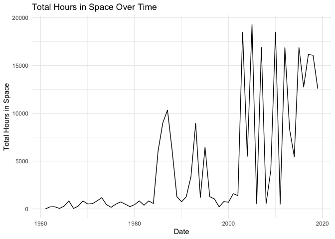
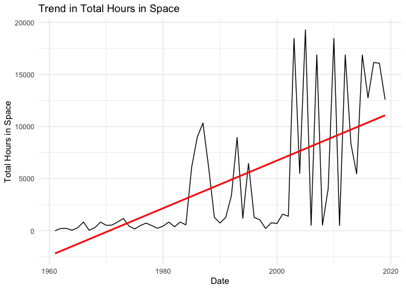
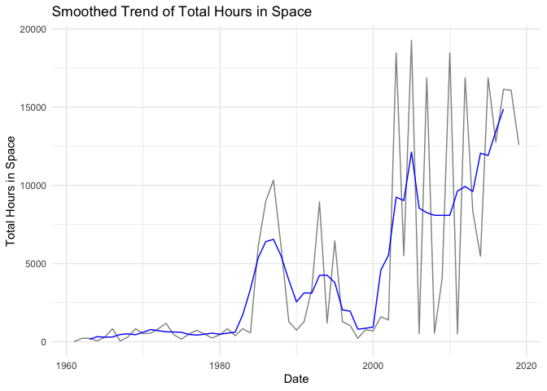
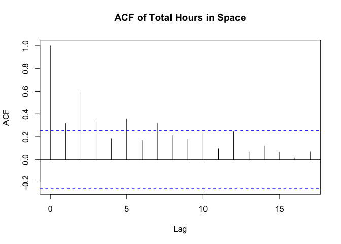
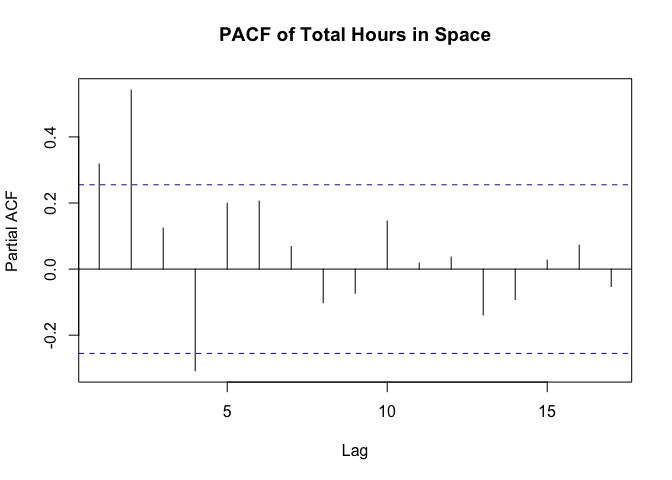

week-12
================
Sneha
2024-11-22

``` r
library(tidyverse)
```

    ## ── Attaching core tidyverse packages ──────────────────────── tidyverse 2.0.0 ──
    ## ✔ dplyr     1.1.4     ✔ readr     2.1.5
    ## ✔ forcats   1.0.0     ✔ stringr   1.5.1
    ## ✔ ggplot2   3.5.1     ✔ tibble    3.2.1
    ## ✔ lubridate 1.9.3     ✔ tidyr     1.3.1
    ## ✔ purrr     1.0.2     
    ## ── Conflicts ────────────────────────────────────────── tidyverse_conflicts() ──
    ## ✖ dplyr::filter() masks stats::filter()
    ## ✖ dplyr::lag()    masks stats::lag()
    ## ℹ Use the conflicted package (<http://conflicted.r-lib.org/>) to force all conflicts to become errors

``` r
library(ggthemes)
library(ggrepel)
library(xts)
```

    ## Loading required package: zoo
    ## 
    ## Attaching package: 'zoo'
    ## 
    ## The following objects are masked from 'package:base':
    ## 
    ##     as.Date, as.Date.numeric
    ## 
    ## 
    ## ######################### Warning from 'xts' package ##########################
    ## #                                                                             #
    ## # The dplyr lag() function breaks how base R's lag() function is supposed to  #
    ## # work, which breaks lag(my_xts). Calls to lag(my_xts) that you type or       #
    ## # source() into this session won't work correctly.                            #
    ## #                                                                             #
    ## # Use stats::lag() to make sure you're not using dplyr::lag(), or you can add #
    ## # conflictRules('dplyr', exclude = 'lag') to your .Rprofile to stop           #
    ## # dplyr from breaking base R's lag() function.                                #
    ## #                                                                             #
    ## # Code in packages is not affected. It's protected by R's namespace mechanism #
    ## # Set `options(xts.warn_dplyr_breaks_lag = FALSE)` to suppress this warning.  #
    ## #                                                                             #
    ## ###############################################################################
    ## 
    ## Attaching package: 'xts'
    ## 
    ## The following objects are masked from 'package:dplyr':
    ## 
    ##     first, last

``` r
library(tsibble)
```

    ## Registered S3 method overwritten by 'tsibble':
    ##   method               from 
    ##   as_tibble.grouped_df dplyr
    ## 
    ## Attaching package: 'tsibble'
    ## 
    ## The following object is masked from 'package:zoo':
    ## 
    ##     index
    ## 
    ## The following object is masked from 'package:lubridate':
    ## 
    ##     interval
    ## 
    ## The following objects are masked from 'package:base':
    ## 
    ##     intersect, setdiff, union

``` r
theme_set(theme_minimal())
options(scipen = 6)
```

``` r
astro <- read_delim('/Users/sneha/H510-Statistics/astronaut-data.csv')
```

    ## Rows: 1277 Columns: 23
    ## ── Column specification ────────────────────────────────────────────────────────
    ## Delimiter: ","
    ## chr (10): name, sex, nationality, military_civilian, selection, occupation, ...
    ## dbl (13): id, number, nationwide_number, year_of_birth, year_of_selection, m...
    ## 
    ## ℹ Use `spec()` to retrieve the full column specification for this data.
    ## ℹ Specify the column types or set `show_col_types = FALSE` to quiet this message.

Select a column of your data that encodes time (e.g., “date”,
“timestamp”, “year”, etc.). Convert this into a Date in R.

``` r
astro$mission_date <- as.Date(paste(astro$year_of_mission, "01", "01", sep = "-"))
```

``` r
response <- astro |> select(mission_date, total_hrs_sum)
```

``` r
#ts_data <- response |> as_tsibble(index = mission_date)
```

Since i ended up getting error, i will have to remove duplicates from
this column. tsibble objects should have unique rows for each
combination of key and index.

``` r
duplicates <- response |> duplicates(index = mission_date)
print(duplicates)
```

    ## # A tibble: 1,276 × 2
    ##    mission_date total_hrs_sum
    ##    <date>               <dbl>
    ##  1 1961-01-01            1.77
    ##  2 1961-01-01           25.3 
    ##  3 1962-01-01          218   
    ##  4 1998-01-01          218   
    ##  5 1962-01-01            5   
    ##  6 1962-01-01          519.  
    ##  7 1970-01-01          519.  
    ##  8 1962-01-01          448.  
    ##  9 1974-01-01          448.  
    ## 10 1962-01-01          295.  
    ## # ℹ 1,266 more rows

Removing duplicates and keeping the first instance:

``` r
response_data <- response |> distinct(mission_date, .keep_all = TRUE)
```

``` r
ts_data <- response_data |> as_tsibble(index = mission_date)
```

Plotting data over time:

``` r
ts_data |> 
  ggplot(aes(x = mission_date, y = total_hrs_sum)) + 
  geom_line() + 
  labs(title = "Total Hours in Space Over Time", x = "Date", y = "Total Hours in Space")
```

<!-- -->

The line graph titled “Total Hours in Space Over Time” shows a clear
upward trend in the number of hours spent in space over the years.

1)The overall trend is upward, indicating that the amount of time humans
have spent in space has been increasing over the decades.

2)There are significant fluctuations within this upward trend. Some
years see a sharp increase in hours spent in space, while others show a
decrease.

3)there appear to be a few peaks in the graph, which might correspond to
specific events or missions that involved extended stays in space.

My Interpretations:

The upward trend likely reflects the advancements in space technology
and the growing interest in space exploration.

Linear Regression:

``` r
model <- lm(total_hrs_sum ~ mission_date, data = ts_data)
summary(model)
```

    ## 
    ## Call:
    ## lm(formula = total_hrs_sum ~ mission_date, data = ts_data)
    ## 
    ## Residuals:
    ##     Min      1Q  Median      3Q     Max 
    ## -8751.1 -3169.6  -344.5  2120.4 11401.8 
    ## 
    ## Coefficients:
    ##                Estimate Std. Error t value     Pr(>|t|)    
    ## (Intercept)  -121.43840  939.56018  -0.129        0.898    
    ## mission_date    0.62588    0.09793   6.391 0.0000000327 ***
    ## ---
    ## Signif. codes:  0 '***' 0.001 '**' 0.01 '*' 0.05 '.' 0.1 ' ' 1
    ## 
    ## Residual standard error: 4679 on 57 degrees of freedom
    ## Multiple R-squared:  0.4175, Adjusted R-squared:  0.4072 
    ## F-statistic: 40.85 on 1 and 57 DF,  p-value: 0.00000003265

Below is my analysis:

The coefficient for mission date is 0.625, with a very low p-value
(0.00000003), indicating that it is highly statistically
significant.This suggests a clear relationship between between mission
date and total hrs sum.

A positive coefficient for mission date suggests an **upward trend** in
total hrs sum over time. This means that, on average, the total mission
hours are increasing as the mission date gets later.

``` r
ts_data |>
  ggplot(aes(x = mission_date, y = total_hrs_sum)) +
  geom_line() +
  geom_smooth(method = "lm", color = "red", se = FALSE) +
  labs(title = "Trend in Total Hours in Space", x = "Date", y = "Total Hours in Space")
```

    ## `geom_smooth()` using formula = 'y ~ x'

<!-- -->

I think this model captures the general upward trajectory of the “Total
Hours in Space” over time.

The red line, representing the linear regression, clearly shows an
upward slope, suggesting that the total hours spent in space have been
increasing over the years.

``` r
subset_data <- ts_data |> filter(mission_date >= as.Date("1990-01-01"))
```

Trying to smooth out the graph for better clarity:

``` r
smoothed_data <- ts_data |>
  mutate(smoothed = forecast::ma(total_hrs_sum, order = 5))
```

    ## Registered S3 method overwritten by 'quantmod':
    ##   method            from
    ##   as.zoo.data.frame zoo

I saw this forcast package which might be helpful with analysing trend

``` r
library(forecast)
```

``` r
smoothed_data |>
  ggplot(aes(x = mission_date)) +
  geom_line(aes(y = total_hrs_sum), alpha = 0.5) +
  geom_line(aes(y = smoothed), color = "blue") +
  labs(title = "Smoothed Trend of Total Hours in Space", x = "Date", y = "Total Hours in Space")
```

    ## Warning: Removed 4 rows containing missing values or values outside the scale range
    ## (`geom_line()`).

<!-- -->

``` r
acf(ts_data$total_hrs_sum, main = "ACF of Total Hours in Space")
```

<!-- -->

``` r
pacf(ts_data$total_hrs_sum, main = "PACF of Total Hours in Space")
```

<!-- -->

**In this specific ACF graph, there is no clear evidence of
seasonality.** The ACF values do not show any significant spikes at
regular intervals that would suggest a repeating seasonal pattern.

**Initial Spikes:**We observe a few initial spikes in the ACF values,
suggesting some degree of autocorrelation in the short term. However,
these spikes quickly decay.

The ACF values generally reduces as the lag increases, indicating that
the correlation between the time series and its lagged values weakens
over time.

PACF:

We observe a few initial spikes in the PACF values, suggesting some
degree of direct correlation between the time series and its immediate
past values.

There is no clear pattern or significant spikes at regular intervals in
the PACF, suggesting that there is no significant seasonal component in
the data.

Overall, the PACF plot indicates that the “Total Hours in Space” data
exhibits some short-term dependence but lacks a strong seasonal
component or long-term trends.

I think this maybe due to removal of duplicates from the entry.
