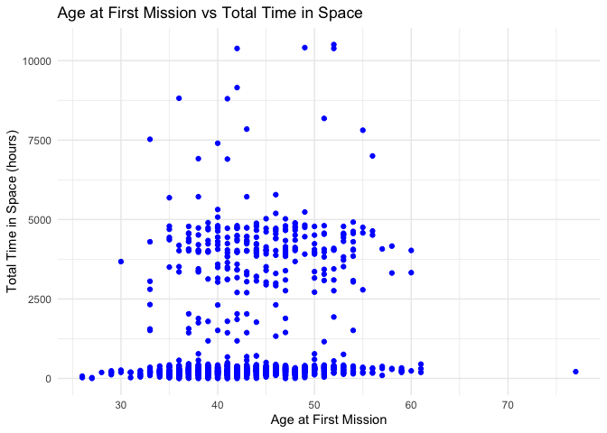
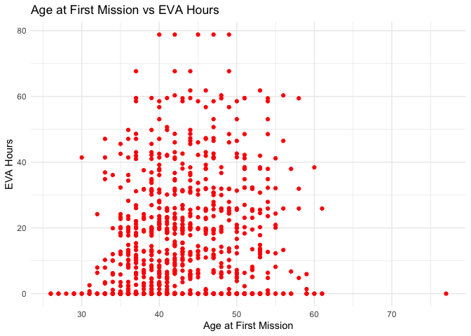

week-6
================
Sneha
2024-11-12

``` r
library(tidyverse)
```

    ## ── Attaching core tidyverse packages ──────────────────────── tidyverse 2.0.0 ──
    ## ✔ dplyr     1.1.4     ✔ readr     2.1.5
    ## ✔ forcats   1.0.0     ✔ stringr   1.5.1
    ## ✔ ggplot2   3.5.1     ✔ tibble    3.2.1
    ## ✔ lubridate 1.9.3     ✔ tidyr     1.3.1
    ## ✔ purrr     1.0.2     
    ## ── Conflicts ────────────────────────────────────────── tidyverse_conflicts() ──
    ## ✖ dplyr::filter() masks stats::filter()
    ## ✖ dplyr::lag()    masks stats::lag()
    ## ℹ Use the conflicted package (<http://conflicted.r-lib.org/>) to force all conflicts to become errors

``` r
astro <- read_delim('/Users/sneha/H510-Statistics/astronaut-data.csv')
```

    ## Rows: 1277 Columns: 23
    ## ── Column specification ────────────────────────────────────────────────────────
    ## Delimiter: ","
    ## chr (10): name, sex, nationality, military_civilian, selection, occupation, ...
    ## dbl (13): id, number, nationwide_number, year_of_birth, year_of_selection, m...
    ## 
    ## ℹ Use `spec()` to retrieve the full column specification for this data.
    ## ℹ Specify the column types or set `show_col_types = FALSE` to quiet this message.

### **Creating new variables for analysis:**

1.  **Age at First Mission**: This can be derived by subtracting the
    year of birth from the year of the first mission.

2.  **Total Time in Space (hours)**: This can be a sum of hours_mission
    and total_eva_hrs (extra-vehicular activity hours).

``` r
astro <- astro |>
  mutate(age_at_first_mission = year_of_mission - year_of_birth,
         total_time_in_space = hours_mission + total_eva_hrs)
```

``` r
astro
```

    ## # A tibble: 1,277 × 25
    ##       id number nationwide_number name           sex   year_of_birth nationality
    ##    <dbl>  <dbl>             <dbl> <chr>          <chr>         <dbl> <chr>      
    ##  1     1      1                 1 Gagarin, Yuri  male           1934 U.S.S.R/Ru…
    ##  2     2      2                 2 Titov, Gherman male           1935 U.S.S.R/Ru…
    ##  3     3      3                 1 Glenn, John H… male           1921 U.S.       
    ##  4     4      3                 1 Glenn, John H… male           1921 U.S.       
    ##  5     5      4                 2 Carpenter, M.… male           1925 U.S.       
    ##  6     6      5                 2 Nikolayev, An… male           1929 U.S.S.R/Ru…
    ##  7     7      5                 2 Nikolayev, An… male           1929 U.S.S.R/Ru…
    ##  8     8      6                 4 Popovich, Pav… male           1930 U.S.S.R/Ru…
    ##  9     9      6                 4 Popovich, Pav… male           1930 U.S.S.R/Ru…
    ## 10    10      7                 3 Schirra, Walt… male           1923 U.S.       
    ## # ℹ 1,267 more rows
    ## # ℹ 18 more variables: military_civilian <chr>, selection <chr>,
    ## #   year_of_selection <dbl>, mission_number <dbl>,
    ## #   total_number_of_missions <dbl>, occupation <chr>, year_of_mission <dbl>,
    ## #   mission_title <chr>, ascend_shuttle <chr>, in_orbit <chr>,
    ## #   descend_shuttle <chr>, hours_mission <dbl>, total_hrs_sum <dbl>,
    ## #   field21 <dbl>, eva_hrs_mission <dbl>, total_eva_hrs <dbl>, …

### Proposed Numeric Variable Pairs:

- **Pair 1**: Age at First Mission (explanatory) V/S Total Hours in
  Space (response)

- **Pair 2**: Age at First Mission (explanatory) V/S EVA (spacewalk)
  hours (response)

**Plot 1: Age at First Mission vs Total Time in Space**

``` r
ggplot(astro, aes(x = age_at_first_mission, y = total_time_in_space)) +
  geom_point(color = "blue") +
  labs(title = "Age at First Mission vs Total Time in Space",
       x = "Age at First Mission",
       y = "Total Time in Space (hours)") +
  theme_minimal()
```

<!-- -->

**Age at First Mission vs. Total Time in Space**:

The scatter plot shows a weak positive relationship between the age of
astronauts at their first mission and the total time they spent in
space.

The low correlation between **Age at First Mission** and **Total Time in
Space** suggests that the age at which an astronaut embarks on their
first mission does not have a strong or linear relationship with how
long they spend in space.

The total time an astronaut spends in space can vary greatly depending
on the type of missions they are assigned to. Some missions are
short-term (lasting days or weeks), while others, like those on the
International Space Station (ISS), can last for months. These mission
durations are often determined by factors unrelated to age, such as the
mission’s objectives, duration of specific research experiments, or the
astronaut’s role.

Calculate correlation coefficient:

``` r
cor_age_time <- cor(astro$age_at_first_mission, astro$total_time_in_space)
cor_age_time
```

    ## [1] 0.1560771

The correlation coefficient is **0.156**, indicating a weak positive
correlation. This makes sense given that the points are scattered with
no clear linear trend.

**Outliers:**

One potential outlier in the dataset is an astronaut who embarked on
their **first mission after the age of 70**. This stands out as unusual
because most astronauts tend to retire before reaching this age, given
the physical demands of space travel.

While this data point could indeed indicate a **data entry error**,
there are a few other possibilities

**Exceptional Circumstance**: The astronaut might be an exceptional
individual, such as a highly experienced or specialized scientist,
selected for a unique mission that required their expertise, even at an
advanced age.

**Data Collection Anomaly**: This could also be the result of a **data
anomaly or human error** during data collection.

**Special Roles**: It’s also possible that this individual had a
**non-astronaut role,** like a space tourist.

- From the dataset, we could see that the astronaut was on PSP
  role(special role)

**Plot 2: Age at First Mission vs EVA Hours**

``` r
ggplot(astro, aes(x = age_at_first_mission, y = total_eva_hrs)) +
  geom_point(color = "red") +
  labs(title = "Age at First Mission vs EVA Hours",
       x = "Age at First Mission",
       y = "EVA Hours") +
  theme_minimal()
```

<!-- -->

**Age at First Mission vs. EVA Hours**:

The second scatter plot shows a weak positive relationship between the
age of astronauts at their first mission and the total EVA (spacewalk)
hours, this can be because the total total EVA hours in space often
depends on an astronaut’s specialization rather than their age. Certain
astronauts, such as those with specific scientific or engineering
expertise, may be assigned to longer missions to complete specific
tasks, irrespective of when they first flew.

``` r
cor_age_eva <- cor(astro$age_at_first_mission, astro$total_eva_hrs)
cor_age_eva
```

    ## [1] 0.1280116

The correlation coefficient is **0.128**, also indicating a weak
positive correlation, suggesting that EVA hours do not strongly depend
on the astronaut’s age during their first mission.

Outliers: We could see the same outlier as the graph before

### **Building confidence intervals for the response variables**

**Total Time in Space**

- The 95% confidence interval for the total time astronauts spent in
  space is between **969 hours** and **1159 hours**.

- This interval suggests that, on average, astronauts spend roughly 1061
  hours in space. The relatively wide range reflects some variability in
  total time across astronauts.

``` r
library(boot)
```

``` r
boot_ci <- function (v, func = median, conf = 0.95, n_iter = 1000) {
  # the `boot` library needs the function in this format
  boot_func <- \(x, i) func(x[i])
  
  b <- boot(v, boot_func, R = n_iter)
  
  boot.ci(b, conf = conf, type = "perc")
}
```

``` r
boot_ci(astro$total_time_in_space, mean, 0.95)
```

    ## BOOTSTRAP CONFIDENCE INTERVAL CALCULATIONS
    ## Based on 1000 bootstrap replicates
    ## 
    ## CALL : 
    ## boot.ci(boot.out = b, conf = conf, type = "perc")
    ## 
    ## Intervals : 
    ## Level     Percentile     
    ## 95%   ( 958, 1164 )  
    ## Calculations and Intervals on Original Scale

**EVA Hours (Spacewalk Hours)**:

- The 95% confidence interval for EVA hours is between **9.89 hours**
  and **11.65 hours**.

- This narrower range indicates that astronauts typically spend about
  10-12 hours in spacewalks, with less variation compared to the total
  time in space.

``` r
boot_ci(astro$total_eva_hrs, mean, 0.95)
```

    ## BOOTSTRAP CONFIDENCE INTERVAL CALCULATIONS
    ## Based on 1000 bootstrap replicates
    ## 
    ## CALL : 
    ## boot.ci(boot.out = b, conf = conf, type = "perc")
    ## 
    ## Intervals : 
    ## Level     Percentile     
    ## 95%   ( 9.87, 11.67 )  
    ## Calculations and Intervals on Original Scale

**Insights:**

While age at the first mission seems to have a weak relationship with
both total time in space and EVA hours, the confidence intervals show
meaningful estimates of time astronauts typically spend in these
activities. We could understand that astronauts typically have less EVA
hours in their whole space travel.

Factors such as nationality, mission availability, health, and even
political decisions can influence an astronaut’s total time in space.
These factors introduce randomness into the relationship between age and
total time in space, further weakening the correlation.

Further investigation could examine other factors influencing time in
space, such as nationality, mission type, or selection group.
Additionally, potential outliers suggest that these could be because of
specific missions or data anomaly.

In summary, the weak correlation between **Age at First Mission** and
**Total Time in Space** likely arises because time spent in space is
driven by factors like mission type, specialization, career, and space
program needs, which do not necessarily depend on when the astronaut
first flew. Therefore, age at the first mission has little predictive
power over the total time an astronaut will spend in space.
