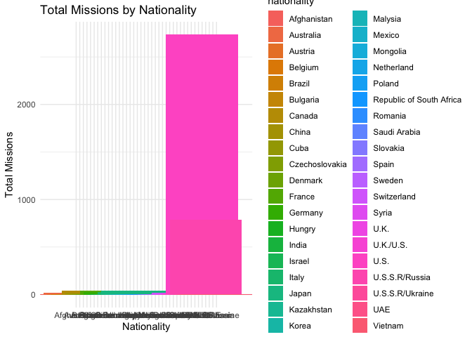

week3
================
Sneha
2024-11-12

**Load the dataset:**

``` r
library(tidyverse)
```

    ## ── Attaching core tidyverse packages ──────────────────────── tidyverse 2.0.0 ──
    ## ✔ dplyr     1.1.4     ✔ readr     2.1.5
    ## ✔ forcats   1.0.0     ✔ stringr   1.5.1
    ## ✔ ggplot2   3.5.1     ✔ tibble    3.2.1
    ## ✔ lubridate 1.9.3     ✔ tidyr     1.3.1
    ## ✔ purrr     1.0.2     
    ## ── Conflicts ────────────────────────────────────────── tidyverse_conflicts() ──
    ## ✖ dplyr::filter() masks stats::filter()
    ## ✖ dplyr::lag()    masks stats::lag()
    ## ℹ Use the conflicted package (<http://conflicted.r-lib.org/>) to force all conflicts to become errors

``` r
data <- read_delim('/Users/sneha/H510-Statistics/astronaut-data.csv')
```

    ## Rows: 1277 Columns: 23
    ## ── Column specification ────────────────────────────────────────────────────────
    ## Delimiter: ","
    ## chr (10): name, sex, nationality, military_civilian, selection, occupation, ...
    ## dbl (13): id, number, nationwide_number, year_of_birth, year_of_selection, m...
    ## 
    ## ℹ Use `spec()` to retrieve the full column specification for this data.
    ## ℹ Specify the column types or set `show_col_types = FALSE` to quiet this message.

**Create 3 Group By Data Frames**

**Group by nationality and summarize total missions and total EVA
hours:**

``` r
nationality_summary <- data |>
  group_by(nationality) |>
  summarize(total_missions = sum(total_number_of_missions),
            total_eva_hours = sum(total_eva_hrs))
print(nationality_summary)
```

    ## # A tibble: 40 × 3
    ##    nationality    total_missions total_eva_hours
    ##    <chr>                   <dbl>           <dbl>
    ##  1 Afghanistan                 1            0   
    ##  2 Australia                  16           25.4 
    ##  3 Austria                     1            0   
    ##  4 Belgium                     5            0   
    ##  5 Brazil                      1            0   
    ##  6 Bulgaria                    2            0   
    ##  7 Canada                     38          101.  
    ##  8 China                      22            0.26
    ##  9 Cuba                        1            0   
    ## 10 Czechoslovakia              1            0   
    ## # ℹ 30 more rows

This result will help us get insights on how astronaut missions and EVA
hours vary by nationality. There are some countries which has very
minimum total mission suggesting that they are not very active in space
industry.

**Group by sex and summarize total hours in orbit and total EVA hours:**

``` r
sex_summary <- data |>
  group_by(sex) |>
  summarize(total_hours_orbit = sum(total_hrs_sum),
            total_eva_hours = sum(total_eva_hrs))
print(sex_summary)
```

    ## # A tibble: 2 × 3
    ##   sex    total_hours_orbit total_eva_hours
    ##   <chr>              <dbl>           <dbl>
    ## 1 female           279966.            697.
    ## 2 male            3510606.          13045.

This result allow us to explore the difference between male and female
astronauts in terms of hours spent in orbit and EVA hours. From the
above data we see that male astronauts have more hours in orbit as well
and total eva hours, which indicates that male astronauts are currently
more represented in space missions compared to female astronauts.

**Group by military/civilian status and summarize total missions and
total hours in orbit**:

``` r
mil_civil_summary <- data |>
  group_by(military_civilian) |>
  summarize(total_missions = sum(total_number_of_missions),
            total_hours_orbit = sum(total_hrs_sum))
print(mil_civil_summary)
```

    ## # A tibble: 2 × 3
    ##   military_civilian total_missions total_hours_orbit
    ##   <chr>                      <dbl>             <dbl>
    ## 1 civilian                    1532          1545595.
    ## 2 military                    2277          2244977.

This grouping allows us to compare the mission and orbit time
contributions between military and civilian astronauts. According to the
above data, there is no significant difference between the hours and
mission of military/civilian astronauts. Hence we can conclude that
Military /civilian status doesnt have much significance on the mission
completion duration.

**Assigning lowest probability group a special tag**

``` r
#Choosing nationality dataframe
Low_nationality_grp <- nationality_summary |>
    filter(total_missions == min(total_missions))

#special tag to the lowest probability
nationality_summary <- nationality_summary |>
   mutate(tag = if_else(total_missions == min(total_missions), "Low_Probability", "Normal"))
```

``` r
Low_nationality_grp
```

    ## # A tibble: 23 × 3
    ##    nationality    total_missions total_eva_hours
    ##    <chr>                   <dbl>           <dbl>
    ##  1 Afghanistan                 1               0
    ##  2 Austria                     1               0
    ##  3 Brazil                      1               0
    ##  4 Cuba                        1               0
    ##  5 Czechoslovakia              1               0
    ##  6 Denmark                     1               0
    ##  7 Hungry                      1               0
    ##  8 India                       1               0
    ##  9 Israel                      1               0
    ## 10 Kazakhstan                  1               0
    ## # ℹ 13 more rows

``` r
nationality_summary
```

    ## # A tibble: 40 × 4
    ##    nationality    total_missions total_eva_hours tag            
    ##    <chr>                   <dbl>           <dbl> <chr>          
    ##  1 Afghanistan                 1            0    Low_Probability
    ##  2 Australia                  16           25.4  Normal         
    ##  3 Austria                     1            0    Low_Probability
    ##  4 Belgium                     5            0    Normal         
    ##  5 Brazil                      1            0    Low_Probability
    ##  6 Bulgaria                    2            0    Normal         
    ##  7 Canada                     38          101.   Normal         
    ##  8 China                      22            0.26 Normal         
    ##  9 Cuba                        1            0    Low_Probability
    ## 10 Czechoslovakia              1            0    Low_Probability
    ## # ℹ 30 more rows

**Hypothesis and probability conclusion**

From the nationality_summary , we observe that astronauts from certain
countries have fewer missions. like Afghanistan, Austria, Brazil, Cuba,
Czechoslovakia.

hypothesis: **Astronauts from countries with fewer missions likely have
smaller space programs, leading to less opportunity for space
missions.**

This might even be because space mission are expensive and countries
with smaller or developing economies may prioritize other immediate
needs like healthcare, education, or infrastructure development over
space programs.

Some countries may not yet have the advanced technology necessary to
launch such missions.

**low probability in grouping by sex:**

``` r
Low_probab_grp <- sex_summary |>
    filter(total_hours_orbit == min(total_hours_orbit))
```

``` r
#special tag to the lowest probability
sex_summary <- sex_summary |>
   mutate(tag = if_else(total_hours_orbit == min(total_hours_orbit), "Low_Probability", "Normal"))
```

``` r
Low_probab_grp
```

    ## # A tibble: 1 × 3
    ##   sex    total_hours_orbit total_eva_hours
    ##   <chr>              <dbl>           <dbl>
    ## 1 female           279966.            697.

``` r
sex_summary
```

    ## # A tibble: 2 × 4
    ##   sex    total_hours_orbit total_eva_hours tag            
    ##   <chr>              <dbl>           <dbl> <chr>          
    ## 1 female           279966.            697. Low_Probability
    ## 2 male            3510606.          13045. Normal

hypothesis: **Male astronauts are currently more represented in space
missions compared to female astronauts.**

This can be due to gender societal stereotypes about women’s roles often
relegated them to domestic spheres, limiting their opportunities in
fields like science, engineering, and aerospace. The number of women in
STEM programs has been historically lower than that of men. This reduces
the number of potential female candidates for space programs.

**Building visualizations**

**Visualization of total missions by nationality**:

``` r
ggplot(nationality_summary, aes(x = nationality, y = total_missions, fill = nationality,width = 20, height = 20)) +
  geom_bar(stat = "identity") +
  theme_minimal() +
  
  labs(title = "Total Missions by Nationality",
       x = "Nationality",
       y = "Total Missions")
```

    ## Warning: `position_stack()` requires non-overlapping x intervals.

<!-- -->

The variables in the x-axis is not visible, but they are listed in the
sidebar, also the countries are marked with color which makes it easy to
identify which country has the most number of missions.(i tried making
the graph bigger, but its not helping me get the country names aligned)

As we can see, the countries with pink shade has the most number of
missions covered. these are US, Russia, UAE, UK.

These are mostly developed countries and have the technological
capabilities necessary to launch and sustain such missions. Also Space
exploration is expensive, requiring significant investments in research,
technology, infrastructure, and skilled personnel, this data above
indicates that these countries have significant resources and investment
in space mission.

**Visualization of hours in orbit by sex**:

``` r
ggplot(sex_summary, aes(x = sex, y = total_hours_orbit, fill = sex)) +
  geom_bar(stat = "identity") +
  theme_minimal() +
  labs(title = "Total Hours in Orbit by Sex",
       x = "Sex",
       y = "Total Hours in Orbit")
```

<!-- -->

The graph above indicates the presence of male domination in space
industry. Space industry is a profession that had almost no female
representation in the 1950s and 1960s. This legacy has created
long-standing gender imbalances. This might be due to the physical
standards the earlier space programs had, like height and weight
requirement. This is being prevalent in military as well, making it
harder for women to qualify. But significant progress has been made
toward gender equality in many fields, including space mission nowadays,
which inlcudes the recent case of Sunita Williams, an American
astronaut, has spent over 322 days in space, holding the record for the
most spacewalks by a woman.

**Create a data frame of all combinations of two categorical variables**

selecting unique combinations of nationality and sex

``` r
combinations <- expand.grid(
  nationality = unique(data$nationality),
  sex = unique(data$sex)
)
```

``` r
combinations
```

    ##                 nationality    sex
    ## 1            U.S.S.R/Russia   male
    ## 2                      U.S.   male
    ## 3                  Mongolia   male
    ## 4                   Romania   male
    ## 5                    France   male
    ## 6            Czechoslovakia   male
    ## 7                    Poland   male
    ## 8                   Germany   male
    ## 9                  Bulgaria   male
    ## 10                   Hungry   male
    ## 11                  Vietnam   male
    ## 12                     Cuba   male
    ## 13                    India   male
    ## 14                   Canada   male
    ## 15             Saudi Arabia   male
    ## 16               Netherland   male
    ## 17                   Mexico   male
    ## 18                    Syria   male
    ## 19              Afghanistan   male
    ## 20                    Japan   male
    ## 21                     U.K.   male
    ## 22                  Austria   male
    ## 23                  Belgium   male
    ## 24              Switzerland   male
    ## 25                    Italy   male
    ## 26                Australia   male
    ## 27          U.S.S.R/Ukraine   male
    ## 28                    Spain   male
    ## 29                 Slovakia   male
    ## 30 Republic of South Africa   male
    ## 31                U.K./U.S.   male
    ## 32                   Israel   male
    ## 33                    China   male
    ## 34                   Brazil   male
    ## 35                   Sweden   male
    ## 36                  Malysia   male
    ## 37                    Korea   male
    ## 38                  Denmark   male
    ## 39               Kazakhstan   male
    ## 40                      UAE   male
    ## 41           U.S.S.R/Russia female
    ## 42                     U.S. female
    ## 43                 Mongolia female
    ## 44                  Romania female
    ## 45                   France female
    ## 46           Czechoslovakia female
    ## 47                   Poland female
    ## 48                  Germany female
    ## 49                 Bulgaria female
    ## 50                   Hungry female
    ## 51                  Vietnam female
    ## 52                     Cuba female
    ## 53                    India female
    ## 54                   Canada female
    ## 55             Saudi Arabia female
    ## 56               Netherland female
    ## 57                   Mexico female
    ## 58                    Syria female
    ## 59              Afghanistan female
    ## 60                    Japan female
    ## 61                     U.K. female
    ## 62                  Austria female
    ## 63                  Belgium female
    ## 64              Switzerland female
    ## 65                    Italy female
    ## 66                Australia female
    ## 67          U.S.S.R/Ukraine female
    ## 68                    Spain female
    ## 69                 Slovakia female
    ## 70 Republic of South Africa female
    ## 71                U.K./U.S. female
    ## 72                   Israel female
    ## 73                    China female
    ## 74                   Brazil female
    ## 75                   Sweden female
    ## 76                  Malysia female
    ## 77                    Korea female
    ## 78                  Denmark female
    ## 79               Kazakhstan female
    ## 80                      UAE female

``` r
existing_combinations <- data |>
  select(nationality, sex) |>
  distinct()

existing_combinations
```

    ## # A tibble: 48 × 2
    ##    nationality    sex   
    ##    <chr>          <chr> 
    ##  1 U.S.S.R/Russia male  
    ##  2 U.S.           male  
    ##  3 U.S.S.R/Russia female
    ##  4 Mongolia       male  
    ##  5 Romania        male  
    ##  6 France         male  
    ##  7 Czechoslovakia male  
    ##  8 Poland         male  
    ##  9 Germany        male  
    ## 10 Bulgaria       male  
    ## # ℹ 38 more rows

Finding missing combinations:

``` r
missing_combinations <- anti_join(combinations, existing_combinations, by = c("nationality", "sex"))
```

``` r
missing_combinations
```

    ##                 nationality    sex
    ## 1                     Korea   male
    ## 2                  Mongolia female
    ## 3                   Romania female
    ## 4            Czechoslovakia female
    ## 5                    Poland female
    ## 6                   Germany female
    ## 7                  Bulgaria female
    ## 8                    Hungry female
    ## 9                   Vietnam female
    ## 10                     Cuba female
    ## 11                    India female
    ## 12             Saudi Arabia female
    ## 13               Netherland female
    ## 14                   Mexico female
    ## 15                    Syria female
    ## 16              Afghanistan female
    ## 17                  Austria female
    ## 18                  Belgium female
    ## 19              Switzerland female
    ## 20                Australia female
    ## 21          U.S.S.R/Ukraine female
    ## 22                    Spain female
    ## 23                 Slovakia female
    ## 24 Republic of South Africa female
    ## 25                U.K./U.S. female
    ## 26                   Israel female
    ## 27                   Brazil female
    ## 28                   Sweden female
    ## 29                  Malysia female
    ## 30                  Denmark female
    ## 31               Kazakhstan female
    ## 32                      UAE female

It is very interesting to see that Korea has not sent a male astronaut
to space. which might be due to missing records in the dataset.

Also, as expected, most of the countries have not sent female
astronauts. The absence of female astronauts from various nationalities,
excluding Korea, suggests there might be a gender representation issue.
This could point to a lack of data or potentially highlight an
underrepresentation of female astronauts in the dataset.

There is possibility that the dataset might be be up to date, as we can
see there is a significant progress has been made toward gender equality
in many fields, including space mission nowadays.
