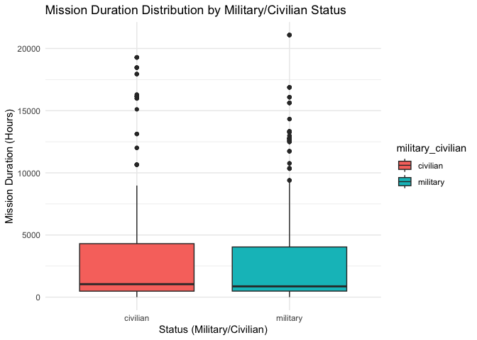
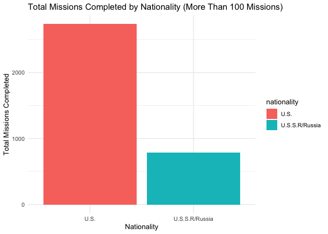

Week-1
================
Sneha
2024-11-12

## Assignment : 1

``` r
library(tidyverse) 
```

    ## ── Attaching core tidyverse packages ──────────────────────── tidyverse 2.0.0 ──
    ## ✔ dplyr     1.1.4     ✔ readr     2.1.5
    ## ✔ forcats   1.0.0     ✔ stringr   1.5.1
    ## ✔ ggplot2   3.5.1     ✔ tibble    3.2.1
    ## ✔ lubridate 1.9.3     ✔ tidyr     1.3.1
    ## ✔ purrr     1.0.2     
    ## ── Conflicts ────────────────────────────────────────── tidyverse_conflicts() ──
    ## ✖ dplyr::filter() masks stats::filter()
    ## ✖ dplyr::lag()    masks stats::lag()
    ## ℹ Use the conflicted package (<http://conflicted.r-lib.org/>) to force all conflicts to become errors

Loading the data : Using astronaut dataset.

Loading the CSV file to astro

``` r
astro <- read_delim('/Users/sneha/H510-Statistics/work-H510/R-Data_Visualizations/astronaut-data.csv')
```

    ## Rows: 1277 Columns: 23
    ## ── Column specification ────────────────────────────────────────────────────────
    ## Delimiter: ","
    ## chr (10): name, sex, nationality, military_civilian, selection, occupation, ...
    ## dbl (13): id, number, nationwide_number, year_of_birth, year_of_selection, m...
    ## 
    ## ℹ Use `spec()` to retrieve the full column specification for this data.
    ## ℹ Specify the column types or set `show_col_types = FALSE` to quiet this message.

``` r
#head(astro, 5)
```

## Numeric Summary

**Total number of mission’s completed based on sex**

``` r
astro |>
  group_by(sex) |>
  summarise(count_mission = sum(total_number_of_missions))
```

    ## # A tibble: 2 × 2
    ##   sex    count_mission
    ##   <chr>          <dbl>
    ## 1 female           428
    ## 2 male            3381

There is a significant disparity between the number of missions
completed by female and male astronauts. Male astronauts have completed
far more missions than female astronauts.The data suggests that male
astronauts are currently more represented in space missions compared to
female astronauts.

**Analyzing year of selection**

``` r
astro |>
  summarise(year_of_selection)
```

    ## Warning: Returning more (or less) than 1 row per `summarise()` group was deprecated in
    ## dplyr 1.1.0.
    ## ℹ Please use `reframe()` instead.
    ## ℹ When switching from `summarise()` to `reframe()`, remember that `reframe()`
    ##   always returns an ungrouped data frame and adjust accordingly.
    ## Call `lifecycle::last_lifecycle_warnings()` to see where this warning was
    ## generated.

    ## # A tibble: 1,277 × 1
    ##    year_of_selection
    ##                <dbl>
    ##  1              1960
    ##  2              1960
    ##  3              1959
    ##  4              1959
    ##  5              1959
    ##  6              1960
    ##  7              1960
    ##  8              1960
    ##  9              1960
    ## 10              1959
    ## # ℹ 1,267 more rows

``` r
astro |>
  summarise(min_year= min(year_of_selection))
```

    ## # A tibble: 1 × 1
    ##   min_year
    ##      <dbl>
    ## 1     1959

From the data, we observe that space missions began around 1959, which
aligns with historical records, as the Soviet Union launched the first
satellite, Sputnik, into space in 1957. Consequently, it’s possible that
the dataset may not include data for the years 1957-1958.

**Mean mission years**

``` r
astro |>
  group_by(nationality) |>
  summarise(mean_mission = mean(year_of_mission))
```

    ## # A tibble: 40 × 2
    ##    nationality    mean_mission
    ##    <chr>                 <dbl>
    ##  1 Afghanistan           1988 
    ##  2 Australia             1997.
    ##  3 Austria               1991 
    ##  4 Belgium               2001 
    ##  5 Brazil                2006 
    ##  6 Bulgaria              1984.
    ##  7 Canada                2001.
    ##  8 China                 2010.
    ##  9 Cuba                  1980 
    ## 10 Czechoslovakia        1978 
    ## # ℹ 30 more rows

We could see most of the missions are between the year 1980 - 2010. We
could conclude that space missions became more popular between these
years for majority of the countries.

**counting the unique occupation of people**

``` r
astro |>
  pull(occupation) |>
  table()
```

    ## 
    ##               commander         flight engineer                     MSP 
    ##                     315                     196                     498 
    ##      Other (Journalist)                   pilot                   Pilot 
    ##                       1                     196                       1 
    ##                     PSP           Space tourist spaceflight participant 
    ##                      59                      10                       1

It is interesting to know that journalist and tourist have also been to
space. highlighting how space travel is gradually expanding beyond
professional astronauts and scientists. Maybe advancements in technology
is making space accessible to civilians.

``` r
occupation_counts <- astro |>
  count(occupation) |>
  arrange(desc(n))
```

``` r
occupation_counts
```

    ## # A tibble: 9 × 2
    ##   occupation                  n
    ##   <chr>                   <int>
    ## 1 MSP                       498
    ## 2 commander                 315
    ## 3 flight engineer           196
    ## 4 pilot                     196
    ## 5 PSP                        59
    ## 6 Space tourist              10
    ## 7 Other (Journalist)          1
    ## 8 Pilot                       1
    ## 9 spaceflight participant     1

It is evident that the majority of the occupations fall under the MSP
(Mission Specialist) title, and interestingly, there are more commanders
than pilots. As of now the number of space tourists are less, but it is
interesting to know that people are going to space which will be more in
the coming future.

**Distribution of Nationalities in the Astronaut Dataset**

``` r
astro |>
  group_by(nationality) |>
  summarize(count_nation = n())
```

    ## # A tibble: 40 × 2
    ##    nationality    count_nation
    ##    <chr>                 <int>
    ##  1 Afghanistan               1
    ##  2 Australia                 4
    ##  3 Austria                   1
    ##  4 Belgium                   3
    ##  5 Brazil                    1
    ##  6 Bulgaria                  2
    ##  7 Canada                   18
    ##  8 China                    14
    ##  9 Cuba                      1
    ## 10 Czechoslovakia            1
    ## # ℹ 30 more rows

Filtering nationality - with count more than 100

``` r
astro |>
  group_by(nationality) |>
  summarize(count_nation = n()) |>
  filter(count_nation >=100)
```

    ## # A tibble: 2 × 2
    ##   nationality    count_nation
    ##   <chr>                 <int>
    ## 1 U.S.                    854
    ## 2 U.S.S.R/Russia          273

It can be observed that US and Russia are the only nations that has been
listed more than 100 times in the dataset, which mean most of the
astronauts in the dataset are either from the US or Russia.

## 3 novel questions to investigate

Question 1 : How does the number of missions completed vary across
different nationalities ?

Question 2 : In which year did maximum number of missions happen?

Question 3 : What are the patterns in Duration of mission in hours based
on the spacecraft used in the orbit?

**Data Documentation**

This dataset contains publically available information about all
astronauts who participated in space missions before 15 January 2020
collected from NASA, Roscosmos, and fun-made websites. The provided
information includes full astronaut name, sex, date of birth,
nationality, military status, a title and year of a selction program,
and information about each mission completed by a particular astronaut
such as a year, ascend and descend shuttle names, mission and
extravehicular activity (EVAs) durations.

### Task : Address at least one of the above questions using an aggregation function

### Question addressed : How does the number of missions completed vary across different nationalities ?

``` r
astro %>%  
  aggregate(total_number_of_missions ~ nationality, data = ., FUN = sum) 
```

    ##                 nationality total_number_of_missions
    ## 1               Afghanistan                        1
    ## 2                 Australia                       16
    ## 3                   Austria                        1
    ## 4                   Belgium                        5
    ## 5                    Brazil                        1
    ## 6                  Bulgaria                        2
    ## 7                    Canada                       38
    ## 8                     China                       22
    ## 9                      Cuba                        1
    ## 10           Czechoslovakia                        1
    ## 11                  Denmark                        1
    ## 12                   France                       38
    ## 13                  Germany                       28
    ## 14                   Hungry                        1
    ## 15                    India                        1
    ## 16                   Israel                        1
    ## 17                    Italy                       29
    ## 18                    Japan                       42
    ## 19               Kazakhstan                        1
    ## 20                    Korea                        1
    ## 21                  Malysia                        1
    ## 22                   Mexico                        1
    ## 23                 Mongolia                        1
    ## 24               Netherland                        5
    ## 25                   Poland                        1
    ## 26 Republic of South Africa                        1
    ## 27                  Romania                        1
    ## 28             Saudi Arabia                        1
    ## 29                 Slovakia                        1
    ## 30                    Spain                        4
    ## 31                   Sweden                        4
    ## 32              Switzerland                       16
    ## 33                    Syria                        1
    ## 34                     U.K.                        2
    ## 35                U.K./U.S.                       14
    ## 36                     U.S.                     2734
    ## 37           U.S.S.R/Russia                      787
    ## 38          U.S.S.R/Ukraine                        1
    ## 39                      UAE                        1
    ## 40                  Vietnam                        1

Finding out which all nations has more than 20 total missions

``` r
astro %>%  
  aggregate(total_number_of_missions ~ nationality, data = ., FUN = sum) |> 
  filter( total_number_of_missions >= 20 ) |>
  pluck("nationality")
```

    ## [1] "Canada"         "China"          "France"         "Germany"       
    ## [5] "Italy"          "Japan"          "U.S."           "U.S.S.R/Russia"

Canada, China, France, Germany, Italy, Japan, US, USSR/Russia are the
nations which has more than 20 missions completed.

**Question 2 : In which year did maximum number of missions happen?**

``` r
astro |>
  group_by(year_of_selection) |>
  summarize(count_missions = sum(total_number_of_missions)) |>
  filter(count_missions == max(count_missions))
```

    ## # A tibble: 1 × 2
    ##   year_of_selection count_missions
    ##               <dbl>          <dbl>
    ## 1              1978            444

From above output, we could understand that the year 1978 had the most
number of missions to space.

**Question 3 : What are the patterns in Duration of mission in hours
based on the spacecraft used in the orbit?**

``` r
patterns_in_duration <- astro |>
  group_by(in_orbit) |>
  summarize(
    mean_duration = mean(total_hrs_sum),
    median_duration = median(total_hrs_sum),
    min_duration = min(total_hrs_sum),
    max_duration = max(total_hrs_sum)
  )
patterns_in_duration
```

    ## # A tibble: 289 × 5
    ##    in_orbit  mean_duration median_duration min_duration max_duration
    ##    <chr>             <dbl>           <dbl>        <dbl>        <dbl>
    ##  1 ASTP               490.            508          217.         746 
    ##  2 Apollo 10          636.            565          508          836.
    ##  3 Apollo 11          254.            266          206          289 
    ##  4 Apollo 12         1056.           1179          316.        1672.
    ##  5 Apollo 13          333.            142          142          715.
    ##  6 Apollo 14          216.            216          216          216.
    ##  7 Apollo 15          379.            295.         295          546 
    ##  8 Apollo 16          536.            508          265          836.
    ##  9 Apollo 17          389             301          301          565 
    ## 10 Apollo 7           272.            260.         260          295.
    ## # ℹ 279 more rows

Above summarize() method Summarizes the data for each group
(spacecraft), calculating

- mean_duration: The average duration of missions.

- median_duration: The median duration of missions.

- min_duration: The shortest mission duration.

- max_duration: The longest mission duration.

## Visual summaries : Including Plots

## Analysing patterns in Duration of mission in hours based on Military/Civilian status

``` r
status <- astro |>
  group_by(military_civilian) |>
  summarise(mean_hours = mean(total_hrs_sum))

status
```

    ## # A tibble: 2 × 2
    ##   military_civilian mean_hours
    ##   <chr>                  <dbl>
    ## 1 civilian               3043.
    ## 2 military               2919.

``` r
ggplot(astro, aes(x = military_civilian, y = total_hrs_sum, fill = military_civilian)) +
  geom_boxplot() +
  labs(title = "Mission Duration Distribution by Military/Civilian Status",
       x = "Status (Military/Civilian)",
       y = "Mission Duration (Hours)") +
  theme_minimal()
```

<!-- -->

From the above graph we could understand that Military /civilian status
doesnt have much significance on the mission completion duration. Both
of their mean hours are nearly close.

## Bar Plot of Number of Missions by Nationality

Grouping by nationality and counting the number of missions completed
and filtering them based on more number of missions(\>=100)

``` r
missions_by_nationality <- astro |>
  group_by(nationality) |>
  summarise(total_missions = sum(total_number_of_missions)) |>
  filter( total_missions >= 100 ) 
missions_by_nationality
```

    ## # A tibble: 2 × 2
    ##   nationality    total_missions
    ##   <chr>                   <dbl>
    ## 1 U.S.                     2734
    ## 2 U.S.S.R/Russia            787

``` r
ggplot(missions_by_nationality, aes(x = nationality, y = total_missions, fill = nationality)) +
  geom_bar(stat = "identity") +
  labs(title = "Total Missions Completed by Nationality (More Than 100 Missions)",
       x = "Nationality",
       y = "Total Missions Completed") +
  theme_minimal()
```

<!-- -->

The graph above indicates that the **US** and **Russia** have completed
most missions, with US leading with a count of 2734 missions.
