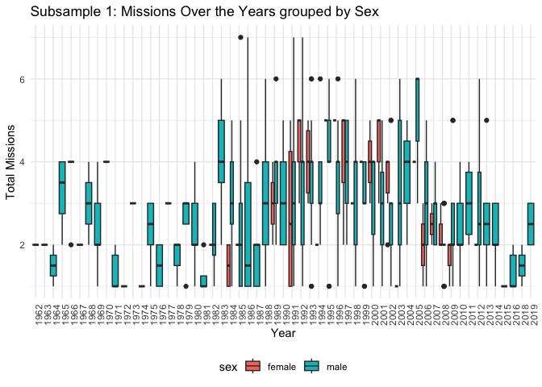
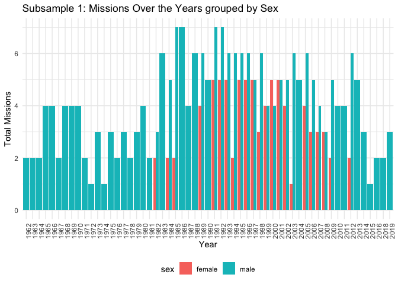
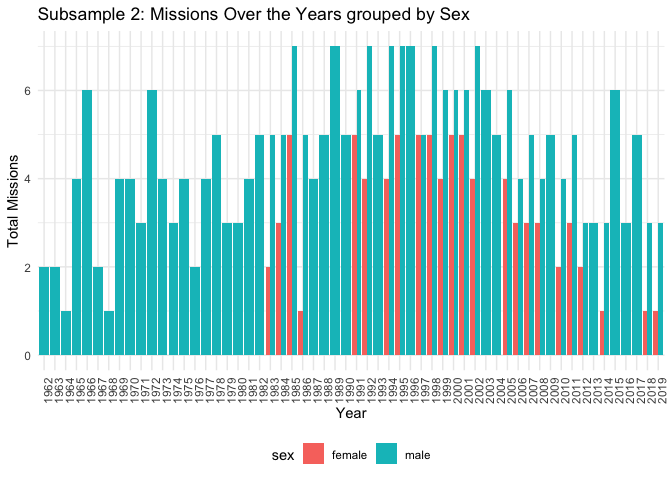
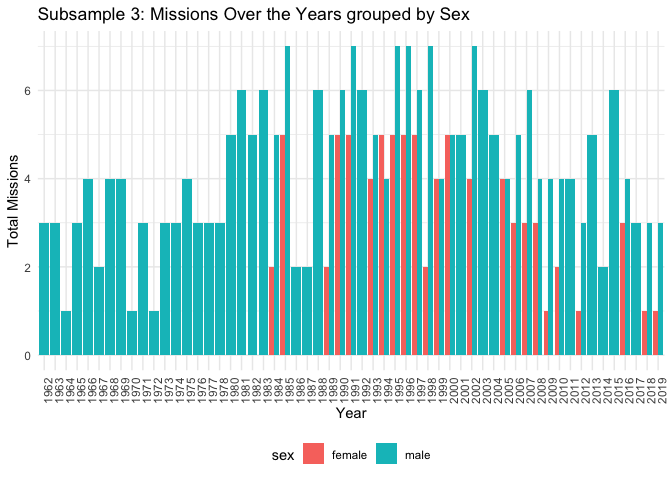
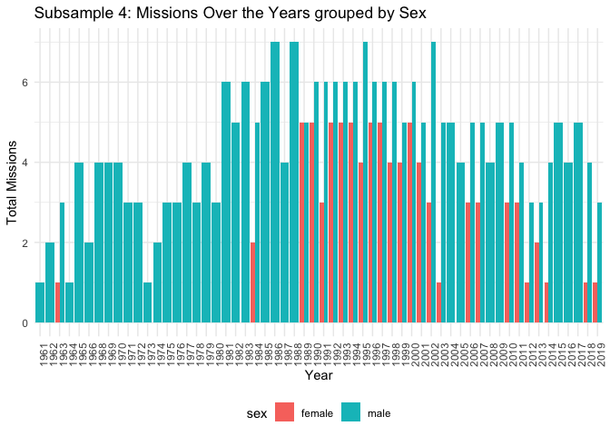
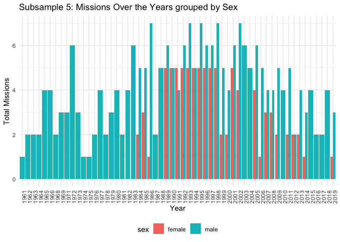

Week-4
================
Sneha
2024-11-12

**Week 4 \| Data Dive — Sampling and Drawing Conclusions**

``` r
library(tidyverse)
```

    ## ── Attaching core tidyverse packages ──────────────────────── tidyverse 2.0.0 ──
    ## ✔ dplyr     1.1.4     ✔ readr     2.1.5
    ## ✔ forcats   1.0.0     ✔ stringr   1.5.1
    ## ✔ ggplot2   3.5.1     ✔ tibble    3.2.1
    ## ✔ lubridate 1.9.3     ✔ tidyr     1.3.1
    ## ✔ purrr     1.0.2     
    ## ── Conflicts ────────────────────────────────────────── tidyverse_conflicts() ──
    ## ✖ dplyr::filter() masks stats::filter()
    ## ✖ dplyr::lag()    masks stats::lag()
    ## ℹ Use the conflicted package (<http://conflicted.r-lib.org/>) to force all conflicts to become errors

**Loading dataset:**

``` r
astro <- read_delim('/Users/sneha/H510-Statistics/astronaut-data.csv')
```

    ## Rows: 1277 Columns: 23
    ## ── Column specification ────────────────────────────────────────────────────────
    ## Delimiter: ","
    ## chr (10): name, sex, nationality, military_civilian, selection, occupation, ...
    ## dbl (13): id, number, nationwide_number, year_of_birth, year_of_selection, m...
    ## 
    ## ℹ Use `spec()` to retrieve the full column specification for this data.
    ## ℹ Specify the column types or set `show_col_types = FALSE` to quiet this message.

``` r
#summary(astro)
```

**A collection of 5 random samples of your data (with replacement).**

We will create five subsamples, each containing roughly 50% of the
original data.

assigning sample size:

``` r
sample_size  <- floor(0.5 * nrow(astro))
sample_size
```

    ## [1] 638

**Generate samples:**

``` r
df_1 <- astro[sample(1:nrow(astro), sample_size, replace = TRUE), ]
```

``` r
#str(df_1)
```

Generating remaining samples.(df_2,df_3,df_4,df_5)

``` r
df_2 <- astro[sample(1:nrow(astro), sample_size, replace = TRUE), ]
df_3 <- astro[sample(1:nrow(astro), sample_size, replace = TRUE), ]
df_4 <- astro[sample(1:nrow(astro), sample_size, replace = TRUE), ]
df_5 <- astro[sample(1:nrow(astro), sample_size, replace = TRUE), ]
```

**Scrutinize the subsamples using GROUP BY:**

Here i am considering to group the dataset by sex and year of mission
and also to get the total mission completed by each gender category.

``` r
df1_summary <- df_1 |>
  group_by(year_of_mission,sex) |>
  summarize(
    total_missions = n(),
    mean_missions = mean(total_number_of_missions)
  )
```

    ## `summarise()` has grouped output by 'year_of_mission'. You can override using
    ## the `.groups` argument.

``` r
df1_summary
```

    ## # A tibble: 82 × 4
    ## # Groups:   year_of_mission [55]
    ##    year_of_mission sex   total_missions mean_missions
    ##              <dbl> <chr>          <int>         <dbl>
    ##  1            1962 male               2          1   
    ##  2            1964 male               1          1   
    ##  3            1965 male               6          2.67
    ##  4            1966 male               4          3.5 
    ##  5            1968 male               3          1   
    ##  6            1969 male               6          2.67
    ##  7            1970 male               6          2.83
    ##  8            1971 male               8          1.38
    ##  9            1972 male               2          2   
    ## 10            1973 male               7          2.14
    ## # ℹ 72 more rows

``` r
df2_summary <- df_2 |>
  group_by(year_of_mission,sex) |>
  summarize(
    total_missions = n(),
    mean_missions = mean(total_number_of_missions)
  )
```

    ## `summarise()` has grouped output by 'year_of_mission'. You can override using
    ## the `.groups` argument.

``` r
df2_summary
```

    ## # A tibble: 85 × 4
    ## # Groups:   year_of_mission [57]
    ##    year_of_mission sex    total_missions mean_missions
    ##              <dbl> <chr>           <int>         <dbl>
    ##  1            1961 male                1          1   
    ##  2            1962 male                2          2.5 
    ##  3            1963 female              2          1   
    ##  4            1965 male                5          1.8 
    ##  5            1966 male                1          4   
    ##  6            1967 male                1          2   
    ##  7            1968 male                4          1.75
    ##  8            1969 male               10          2.3 
    ##  9            1971 male                7          2.14
    ## 10            1972 male                2          1   
    ## # ℹ 75 more rows

``` r
df3_summary <- df_3 |>
  group_by(year_of_mission,sex) |>
  summarize(
    total_missions = n(),
    mean_missions = mean(total_number_of_missions)
  )
```

    ## `summarise()` has grouped output by 'year_of_mission'. You can override using
    ## the `.groups` argument.

``` r
df3_summary
```

    ## # A tibble: 87 × 4
    ## # Groups:   year_of_mission [59]
    ##    year_of_mission sex    total_missions mean_missions
    ##              <dbl> <chr>           <int>         <dbl>
    ##  1            1961 male                1          1   
    ##  2            1962 male                1          2   
    ##  3            1963 female              1          1   
    ##  4            1963 male                1          2   
    ##  5            1964 male                3          1   
    ##  6            1965 male                7          3.14
    ##  7            1966 male                3          3.33
    ##  8            1967 male                1          2   
    ##  9            1968 male                1          1   
    ## 10            1969 male               11          2.82
    ## # ℹ 77 more rows

``` r
df4_summary <- df_4 |>
  group_by(year_of_mission,sex) |>
  summarize(
    total_missions = n(),
    mean_missions = mean(total_number_of_missions)
  )
```

    ## `summarise()` has grouped output by 'year_of_mission'. You can override using
    ## the `.groups` argument.

``` r
df4_summary
```

    ## # A tibble: 80 × 4
    ## # Groups:   year_of_mission [56]
    ##    year_of_mission sex   total_missions mean_missions
    ##              <dbl> <chr>          <int>         <dbl>
    ##  1            1962 male               2          2.5 
    ##  2            1964 male               2          1.5 
    ##  3            1965 male               6          3   
    ##  4            1966 male               7          2.86
    ##  5            1968 male               1          1   
    ##  6            1969 male               8          3.12
    ##  7            1970 male               8          1.75
    ##  8            1971 male               5          1.6 
    ##  9            1972 male               1          1   
    ## 10            1973 male               7          1.86
    ## # ℹ 70 more rows

``` r
df5_summary <- df_5 |>
  group_by(year_of_mission,sex) |>
  summarize(
    total_missions = n(),
    mean_missions = mean(total_number_of_missions)
  )
```

    ## `summarise()` has grouped output by 'year_of_mission'. You can override using
    ## the `.groups` argument.

``` r
df5_summary
```

    ## # A tibble: 80 × 4
    ## # Groups:   year_of_mission [57]
    ##    year_of_mission sex   total_missions mean_missions
    ##              <dbl> <chr>          <int>         <dbl>
    ##  1            1962 male               2          1.5 
    ##  2            1963 male               2          3   
    ##  3            1964 male               2          1.5 
    ##  4            1965 male               6          3.17
    ##  5            1966 male               4          3   
    ##  6            1967 male               1          2   
    ##  7            1968 male               5          1.6 
    ##  8            1969 male               6          2.33
    ##  9            1970 male               1          1   
    ## 10            1971 male               4          2.75
    ## # ℹ 70 more rows

**Using Line graph to plot the total number of missions for each gender
category in each year.**

Red line = Female

Blue line = Male

Trying box-plot as recommended:

``` r
ggplot(df_1, aes(x = factor(year_of_mission), y = total_number_of_missions, fill = sex)) +
  geom_boxplot() +
  labs(title = "Subsample 1: Missions Over the Years grouped by Sex", 
       x = "Year", 
       y = "Total Missions") +
  theme_minimal() +
  theme(legend.position = "bottom", 
        axis.text.x = element_text(angle = 90, hjust = 1))
```

<!-- -->

Since box-plot is not doing a good job at visualization for this
scenario(does not explicitly show the female astronaut in the year
1963), i am considering bar plot below

``` r
ggplot(df_1, aes(x = factor(year_of_mission), y = total_number_of_missions, fill = sex)) +
  geom_bar(stat = "identity", position = position_dodge()) +
  labs(title = "Subsample 1: Missions Over the Years grouped by Sex", 
       x = "Year", 
       y = "Total Missions") +
  theme_minimal() +
  theme(legend.position = "bottom", 
        axis.text.x = element_text(angle = 90, hjust = 1))
```

<!-- -->

``` r
ggplot(df_2, aes(x = factor(year_of_mission), y = total_number_of_missions, fill = sex)) +
  geom_bar(stat = "identity", position = position_dodge()) +
  labs(title = "Subsample 2: Missions Over the Years grouped by Sex", 
       x = "Year", 
       y = "Total Missions") +
  theme_minimal() +
  theme(legend.position = "bottom", 
        axis.text.x = element_text(angle = 90, hjust = 1))
```

<!-- -->

``` r
ggplot(df_3, aes(x = factor(year_of_mission), y = total_number_of_missions, fill = sex)) +
  geom_bar(stat = "identity", position = position_dodge()) +
  labs(title = "Subsample 3: Missions Over the Years grouped by Sex", 
       x = "Year", 
       y = "Total Missions") +
  theme_minimal() +
  theme(legend.position = "bottom", 
        axis.text.x = element_text(angle = 90, hjust = 1))
```

<!-- -->

``` r
ggplot(df_4, aes(x = factor(year_of_mission), y = total_number_of_missions, fill = sex)) +
  geom_bar(stat = "identity", position = position_dodge()) +
  labs(title = "Subsample 4: Missions Over the Years grouped by Sex", 
       x = "Year", 
       y = "Total Missions") +
  theme_minimal() +
  theme(legend.position = "bottom", 
        axis.text.x = element_text(angle = 90, hjust = 1))
```

<!-- -->

``` r
ggplot(df_5, aes(x = factor(year_of_mission), y = total_number_of_missions, fill = sex)) +
  geom_bar(stat = "identity", position = position_dodge()) +
  labs(title = "Subsample 5: Missions Over the Years grouped by Sex", 
       x = "Year", 
       y = "Total Missions") +
  theme_minimal() +
  theme(legend.position = "bottom", 
        axis.text.x = element_text(angle = 90, hjust = 1))
```

<!-- -->

**Are there aspects of the data that are consistent among all
sub-samples?**

Yes, based on the data visualizations, a clear pattern emerged across
all sub-samples: the **“Total missions” peaked between 1980 and 2010**.
This consistency across different sub-samples suggests a global trend
during this period where many countries were actively engaged in space
exploration. The increase in missions might be attributed to several
factors like **Technological Advancements** and **Global Interest in
Space Exploration**.

Additionally, from the above graphs we could see that there was a sudden
peak between the year 1965 to 1970 and then it gradually reduced in the
year 1975 and then increased from 1980 to 2000.

Furthermore, we could also find a pattern in between the year 2000 to
2020 where the space mission gradually decreased.

**How different are they?**

The subsamples are not very different from each other. As illustrated in
the visualization, most space missions began around 1960s, with a
significant concentration occurring between 1980 and 2010. Furthermore,
the data in all the sub sample reveals a predominance of male astronauts
among those who have traveled to space. Only subsample -1 shows a
difference in number of female astronauts.

In sub-samples 2,3,4 - We could see a sudden spike in space mission
around the year 2012-2015 which gradually decreased in the year 2020.
This highlights a declining interest in space missions among nations.

**What would you have called an anomaly in one sub-sample that you
wouldn’t in another?**

The anomaly which i see here is in subsample-1. Only subsample-1
features a female astronaut/flight attendant who traveled to space
during the period between 1960 and 1980. This is particularly striking
because this era was marked by a significant scarcity of female
representation in the field of space exploration. The fact that a woman
participated in missions during this period highlights a breakthrough in
gender representation, signaling an early shift towards inclusivity in a
field traditionally dominated by men.

Lets analyze which country had send a female astronaut to space:

``` r
df_1_anomaly <- df_1 |>
  filter(sex == "female") |>
  filter(year_of_mission >= 1960 & year_of_mission <= 1980)
df_1_anomaly
```

    ## # A tibble: 0 × 23
    ## # ℹ 23 variables: id <dbl>, number <dbl>, nationwide_number <dbl>, name <chr>,
    ## #   sex <chr>, year_of_birth <dbl>, nationality <chr>, military_civilian <chr>,
    ## #   selection <chr>, year_of_selection <dbl>, mission_number <dbl>,
    ## #   total_number_of_missions <dbl>, occupation <chr>, year_of_mission <dbl>,
    ## #   mission_title <chr>, ascend_shuttle <chr>, in_orbit <chr>,
    ## #   descend_shuttle <chr>, hours_mission <dbl>, total_hrs_sum <dbl>,
    ## #   field21 <dbl>, eva_hrs_mission <dbl>, total_eva_hrs <dbl>

<figure>
<embed src="images/tib-01.pdf" width="362" height="103" />
<figcaption aria-hidden="true">Result</figcaption>
</figure>

*Including a picture of the result(tibble 1 X 23) as there is some issue
while knitting and the output is being shown incorrectly.*

As we can see, Russia had sent a female pilot to space in the year 1963.

Upon searching about this fact in the internet i found **Valentina
Tereshkova** is a Soviet cosmonaut and the **first woman to travel into
space**. On June 16, **1963**, she was launched in the spacecraft
**Vostok 6**,which completed 48 orbits in **71** hours. Interestingly,
this information aligns perfectly with our analysis and is exactly the
same information retrieved above .

This finding strengthens our confidence in the authenticity of the
dataset and underscores the accuracy of our analysis. It illustrates
that the dataset is credible and can be used to uncover significant
narratives and trends.

**Insights and Conclusion**

- With the help of line graphs, we could Identify trends in space
  missions over time. It started around 1960 and peaked between the year
  1980 to 2010. Also we were able to find and validate who was the first
  women to go to space.

- We could also identify and compare temporal patterns across subsamples
  and detect anomalies such as female representation in the year 1963
  where Russia send a female pilot to space.

- We could also find that there is a declining interest in space
  missions among nations at present.
